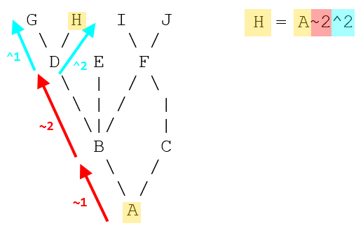

# 整合 Commit 记录

相信大家在使用git 的时候有时会发现自己的commit记录特别多，很多时候10条记录都是在实现同一个feature，这时我们为了让整体repository 的 commit 记录看起来整洁干净，可以用 rebase 命令整合多个commit。


## 例子

首先我们用以下命令来查看我们的commit记录

```
$ git log --oneline

65870f9 add a title for home page
47a007d change style for home page
a3278e3 create home page
54fba21 initial commit
```

我们可以看到前三条commit 信息都是在实现一个homepage，我们完全可以用一行commit来取代。所以我们决定使用这个命令：

```
$ git rebase -i HEAD~3
```

这里的 `-i` 代表的是interactive，有关`~` 和 `^` 在git branch 中代表的位置可以从这幅图看明白：



输入完这行之后控制台会自动打开默认文本编辑器（无设置默认vim）

```
pick 65870f9 add a title for home page
pick 47a007d change style for home page
pick a3278e3 create home page

# Rebase 2c41202..7aaeb81 onto 2c41202 (1 command)
#
# Commands:
# p, pick = use commit
# r, reword = use commit, but edit the commit message
# e, edit = use commit, but stop for amending
# s, squash = use commit, but meld into previous commit
# f, fixup = like "squash", but discard this commit's log message
# x, exec = run command (the rest of the line) using shell
# d, drop = remove commit
#
# These lines can be re-ordered; they are executed from top to bottom.
#
# If you remove a line here THAT COMMIT WILL BE LOST.
#
# However, if you remove everything, the rebase will be aborted.
#
# Note that empty commits are commented out
```

这时我们把第一行`pick 65870f9 add a title for home page` 保留，其他几行的`pick` 改为 `squash`

```
pick 65870f9 add a title for home page
squash 47a007d change style for home page
squash a3278e3 create home page
```

保存（是时候展现真正的技术了，退出vim）后会打开另一个文本

```
# This is a combination of 3 commits.
# This is the 1st commit message:

add a title for home page

# This is the commit message #2:

change style for home page

# This is the 3rd commit message:

create home page
```

这里我们把需要的保留，不需要信息的用 `#` 放在最前边把它当做comment处理。

```
# This is a combination of 3 commits.
# This is the 1st commit message:

# add a title for home page

# This is the commit message #2:

# change style for home page

# This is the 3rd commit message:

create home page
```

之后保存并退出编辑器(:wq)

这时我们已经把三条commit 合并成了一条，然后我们可以做的就是force push 这个变化到remote 服务器：

```
$ git push origin +master
```

 ***\# side note***

后边的 `+<branch_name>` 在只有一个branch时和 `--force` /`-f`的作用是一样的，在存在多个branch的时候 `-f` 会把所有的ref 都强行push到remote，而`+` 会允许你指定哪一个ref 被push。

***\# side note end***


现在再看看你的commit 记录是不是干净很多~