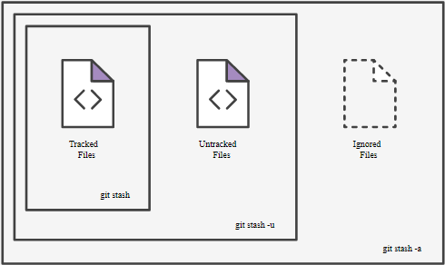

本文翻译并整理自[atlassian.com](https://www.atlassian.com/git/tutorials/git-stash) 

# Git Stash

`git statsh` 是一个用来暂时保存当前修改的堆，这样你就可以在不需要commit的情况下对其它branch或其它仓库进行修改。过后再回到这个暂时保存的仓库状态。


目录

- [暂存当前的修改的状态](#暂存当前的修改状态)
- [回到保存的状态](#回到保存的状态)
- [从stash中建立新的分支](#从stash中建立新的分支)
- [清理stash](#清理stash)


## 暂存当前的修改状态

`git stash` 会将你未commit 的修改 （包括使用 `git add` stage 的和未 stage 的文件）保存起来以便以后使用，然后会 revert 你当前的状态到上一次commit 后的状态。

```bash
$ git status
On branch master
Changes to be committed:
new file: style.css
Changes not staged for commit:
modified: index.html
$ git stash
Saved working directory and index state WIP on master: 5002d47 our new homepage
HEAD is now at 5002d47 our new homepage
$ git status
On branch master
nothing to commit, working tree clean
```


现在你可以随意修改文件，commit，切换分支等等其它的~~骚~~操作了。注意stash 操作只发生在你的本地仓库而不会影响远程服务器的状态。（这部分可以回忆第一章的git 操作与仓库关系图）


`git statsh` 默认会暂存当前工作仓库中**被修改** 但未stage的文件与已stage的文件，但不会保存**新建的**且未stage 的文件与被`.gitignore` 忽略的文件。


`git stash` 为我们提供了`-u` （`--include-untracked`） `-a` （`--all`） 两个选项。`-u` 会包括未追踪的文件，`-a` 会包括未追踪以及被.gitignore忽略的文件。如下图所示：




为了我们之后便于管理，我们在使用该命令时应该使用`save`加一条说明信息，如：

```bash
$ git stash save "add style to our site"
Saved working directory and index state On master: add style to our site
HEAD is now at 5002d47 our new homepage
```


## 回到保存的状态

有两个命令可以回到我们stash中暂存的状态：

`$ git stash pop` 会恢复暂存状态并移除stash 中暂存的内容

`$ git statsh apply` 会恢复暂存状态但不会对stash 做修改

```bash
$ git stash pop
On branch master
Changes to be committed:
new file: style.css
Changes not staged for commit:
modified: index.html
Dropped refs/stash@{0} (32b3aa1d185dfe6d57b3c3cc3b32cbf3e380cc6a)

$ git stash apply
On branch master
Changes to be committed:
new file: style.css
Changes not staged for commit:
modified: index.html
```

`$ git stash apply ` 在我们想要给多个branch做某些相同的改动时非常有用


如果我们在stash中存储了多个内容，我们可以通过`$ git stash list` 来查看当前stash 的状态

```bash
$ git stash list
stash@{0}: On master: add style to our site
stash@{1}: WIP on master: 5002d47 our new homepage
stash@{2}: WIP on master: 5002d47 our new homepage
```

当你在使用pop 或apply时可以通过在其后加list 里的标识来选择应用哪个暂存的状态，如

```bash
$ git stash pop stash@{2}
```


## 从stash中建立新的分支

如果你当前的修改可能与stash 中的修改冲突，在pop 或者apply时可能会遇到麻烦，所以你可以通过`git stash branch`将stash中的修改放入一个新的分支

```bash
$ git stash branch add-stylesheet stash@{1}
Switched to a new branch 'add-stylesheet'
On branch add-stylesheet
Changes to be committed:
new file: style.css
Changes not staged for commit:
modified: index.html
Dropped refs/stash@{1} (32b3aa1d185dfe6d57b3c3cc3b32cbf3e380cc6a)
```

这个操作会checkout 一个新的分支并将暂存在stash中的修改pop到该分支。


## <a name="d"></a>清理stash

如果你觉得某个stash中的内容已不再需要，你可以通过 `git stash drop` 来清除：

```bash
$ git stash drop stash@{1}
Dropped stash@{1} (17e2697fd8251df6163117cb3d58c1f62a5e7cdb)
```

或者你可以掀翻整个堆已达到清理所有stash数据的目的

```bash
$ git stash clear
```

