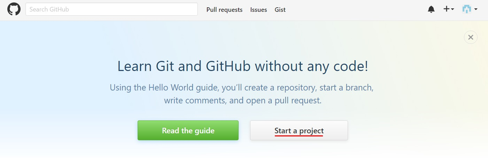
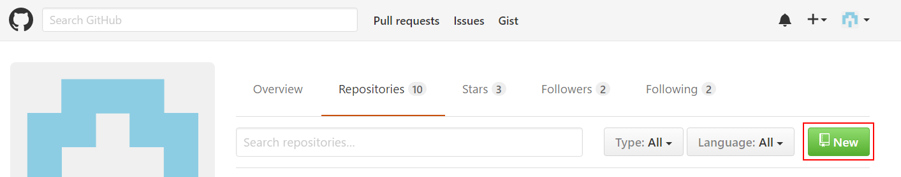
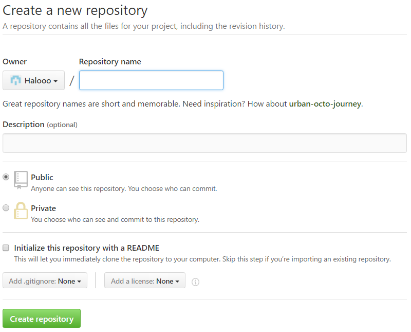
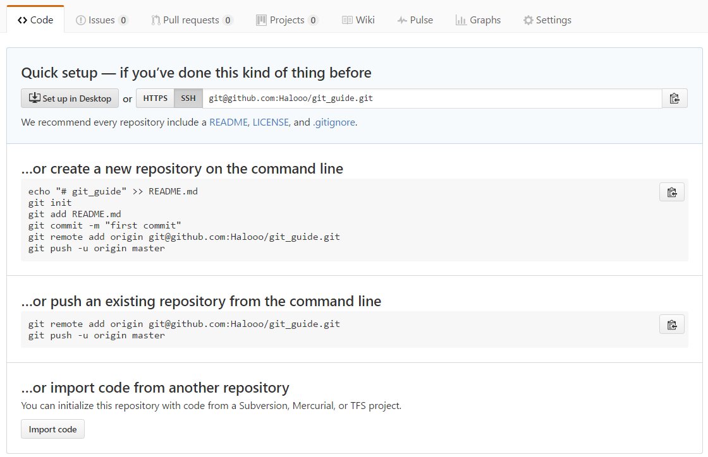
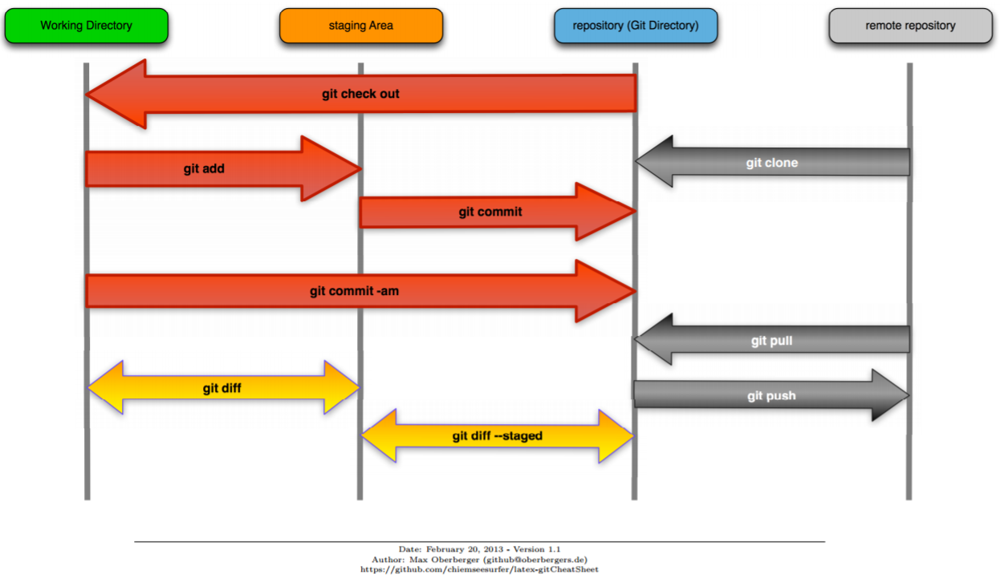
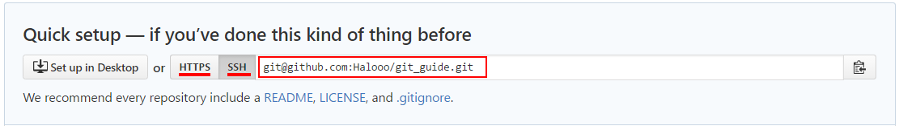

# GitHub 入门

由于之前我自己在网上找资料学习 git 时遇到了很多小的问题，这里为刚刚接触 git 的伙伴们总结一下 github 个人repository 基本的创建和管理，以免重走我自己走过的弯路。


注：本文标注 ***# side note*** 的地方是一些详细的讲解，并不是必须知道的内容，可选择性跳过。


## 先简单介绍一下git

这个在其他教程里也有更为详细的介绍，我这里就不赘述了。当前我们用到的 git 的主要功能就是个人及合作项目记录与管理。（当然 git 也不仅限于这一个功能）


#### 安装 git

Windows 用户可以从 [GitHub](https://github.com)官网下载。现在的OSX 用户与新版本 Ubuntu 用户无需下载，可以跳过安装这一步。Linux 用户可以在 shell 里输入

```shell
$ git
```

如果系统返回了类似这样的提示：

``` shell
The program 'git' is currently not installed. You can install it by typing:
sudo apt-get install git
```

就输入 `sudo apt-get install git` 来进行安装 

（老版本的Debian 和 Ubuntu 用户输入`sudo apt-get install git-core` 来安装）


安装完毕之后可以通过以下两行命令设置 git 全局配置文件的 user name 和 email 参数。

``` shell
$ git config --global user.name "your name"
$ git config --global user.email youremail@host.com
```


### 创建第一个 repository


1. 1 首先在首页点击 Start a project



----------

1. 2 或者在个人 Profile 页面进入 Repository 并点击 New



----------

2. 在新打开的页面输入项目名称；项目描述（可选）；建立README.md 展示文件（打钩，可选；添加 .gitignore，也就是限制当前项目中哪些文件不需要上传的配置文件，这个初学阶段暂时不需要；还有证书（可选）。最后点击绿色按钮 Create repository



----------

3. 点击创建之后可以看到如下图所示的页面




这时你便可以找到你本机想要上传的项目所在的文件目录了，比如我想要把这次名为`git guide` 的文件夹添加为这个repository，我就从bash/terminal 进入这个文件所在的目录 " `/c/git guide` "， 然后输入并执行

```shell
$ git init
```

这时你的文件中便出现了一个名为 `.git` 的隐藏配置文件

如果当前这个文件夹（比如我的 "/c/git guide"）是空的，那就新建一个 README.md （.md 是markdown，一种像写代码一样写类似word文档的文本格式，感兴趣可以搜索并学习一下。本文便是用markdown编辑的）或者 README.txt 的文件来告诉别人你的这个项目是做什么的吧。

``` shell
$ touch README.md
```

新建完成后输入并执行

``` shell
$ git add .
```


***\# side note***

这里需要讲一下 `git add -u`  `git add .`  和`git add -A` 的关系。首先， `add` 用来添加或者声明当前作者对这个项目作出的改动。

`git add .` 会添加当前项目中所有的变化，包括没有被`.gitignore` 忽略的文件，其内容的变化和文件的增加，但是不会声明 `rm` 操作

`git add -u`  会检查所有已经被添加过的文件，确定他们是否更改或被删除。但它不会添加新的文件，只添加被追踪过的文件。

`git add -A` 是以上两个命令的结合，相当于运行了 `git add .; git add -u` 

在这个命令中添加 `-f` 可以强制添加被 `.gitignore` 忽略的文件

***# side note end***


``` shell
$ git commit -m "commit message"
```

这里的commit 是让 git 提交当前被（`add` 命令）添加的文件到repository, 而 "commit message" 则是你对此次提交代码的说明，可以根据你的需求或者公司的要求进行更改（以后可能会讲解在 `.gitconfig` 文件中添加 commit.template 来规范多个组员开发时进行commit 格式规范的内容）。

***# side note*** // 把`-m` 换成 `-am` 便是结合 `add -A`和 `commit` 的操作。




上图很清晰地表示了git 一些基本操作在：本地（working directory），git repository 和 服务器远程（remote repository） 的关系。


如上图所示，我们现在已经把我们对这个项目的更改推行到了git directory上，可是服务器还没有收到任何更改。这时我们需要通过 `remote add` 来添加 remote repository 的地址：

``` shell
$ git remote add origin <URL>
```

`<URL>` 的位置就放上之前github 网页上看到的那个https/ssh URL 地址



初学阶段可以先选择使用HTTPS


***# side note***

https 和 ssh 是用来验证身份的方式。使用https 需要用户在进行push操作时输入github 邮箱账号和密码，后边我会讲如何设置ssh public 和 private key 省去每次输入账号密码的麻烦。这个remote url 可以通过以下这行代码来更改

``` shell
$ git remote set-url origin <new URL>
```

比如之前我们为origin设置的url是 https 验证，"https://github.com/Halooo/git_guide.git" ，在我们设置好SSH 公钥和私钥之后，在`<new URL>` 位置填上 "git@github.com:Halooo/git_guide.git" 就成功将之前的remote地址更改为新的remote地址了。

***# side note end***


添加完远程repository之后，我们就可以把刚刚提交到git上的代码推送到服务器上了，这样所有人都可以通过github看到你的这个开源项目了。输入并执行

``` shell
$ git push origin master
```

***# side note***  

这里 origin 是我们 remote 的名字，master 是 branch 的名字。有关 branch 和大型项目工作流程的知识可以搜索并参考gitflow。个人开发大多情况下只需要一个 master branch 就够了。

***# side note end***


若提示输入用户名密码就输入github注册账号的邮箱以及密码，输入完成之后就可以尝试刷新网页。

恭喜！你成功地在 github 上创建了你的第一个 repository。（开源大法好！）

----------

References:


Latex git Cheat Sheet, 2012-2013 Max Oberberger, https://github.com/chiemseesurfer/latex-gitCheatSheet

Git教程，廖雪峰， http://www.liaoxuefeng.com/

GitHub Guide, GitHub, https://git-scm.com/docs

----------


