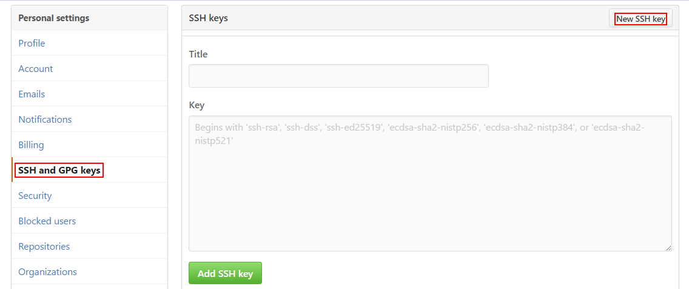

# SSH key 与 GitHub

GitHub 提供两种验证方式，一种便是 https 使用注册邮箱和密码登录验证，另一种是 SSH key 验证。使用 SSH 可以免去我们每次对 remote repository 操作时输入密码的麻烦。


SSH key 包含一个私钥和一个公钥，公钥将放在github上，私钥将保存在本地。只有私钥和公钥配对才可以通过安全验证。


本人的操作环境是 windows 10 + GitBash，在Linux 和 OSX 下应该大同小异。

## 生成并添加一个 SSH key

首先打开 bash/terminal，输入并执行：（`email@host.com`处替换成你自己的邮箱地址）

``` shell
$ ssh-keygen -t rsa -C "email@host.com"
Generating public/private rsa key pair.
Enter a file in which to save the key (/Users/yourname/.ssh/id_rsa): [Press enter]
```

这里你可以选择你新建的这个 SSH key 存放的文件名。直接敲击 `Enter` 会将这个key保存在默认根目录下的 `.ssh` 隐藏文件里并命名为 `id_rsa`，这里可以把密码文件名改成比如`github_id_rsa`。接下来会提示：

``` shell
Enter passphrase (empty for no passphrase): [Type a passphrase]
Enter same passphrase again: [Type passphrase again]
```

这个是让你输入一个使用该SSH key的密码。以防账户被非法登录这里可以编写一个密码加强这个key的安全性。

接下来会提示你的key被成功创建并保存在了 `~/.ssh/` 目录下。

然后在 Git Bash 中输入：

``` shell
$ eval "$(ssh-agent -s)"
```

如果使用的是 Git for Windows，请输入：

``` shell
$ eval $(ssh-agent -s)
```

完成以上步骤后我们便可以在本地添加一个私钥了：(`github_id_rsa` 替换成你刚刚设置保存公钥的文件名)

``` shell 
$ ssh-add ~/.ssh/github_id_rsa
```

如果提示agent没有开启，就运行一下 `ssh-agent bash` 然后再运行上面这行命令。


接下来我们要在根目录的`~/.ssh/`文件中找到我们刚刚创建的公钥，比如使用vim 打开 github_id_rsa.pub 文件

``` shell
$ vim github_id_rsa.pub
```

这时便可以看到我们的公钥了，复制并使用浏览器打开github，进入你的个人设置页面


进入后在左边 Personal Setting 中找到SSH key and GPG keys 并点击进入设置。



点击 New SSH key 并为这个key添加一个title，然后将刚刚复制的public key 粘贴到下方标示 key 的框中，最后点击Add SSH key 完成添加。


## 管理多个账号及 SSH key

在使用时我们可能会遇到个人拥有多个github账号和一个公司gitlab账号的情况。这时我们可能需要设立多个keys来管理我们的 SSH key。

首先要在 `~/.ssh/` 目录下建立一个 `config` 文件

``` shell
$ touch config
```

并在 config 文件中添加你需要管理的keys，假设我们有gitlab和github的两个ssh key：

``` shell
# gitlab
Host gitlab.com
    HostName gitlab.com
    IdentityFile ~/.ssh/gitlab_id_rsa

# github username myaccount
Host github.com-myaccount
    HostName github.com
    IdentityFile ~/.ssh/github_id_rsa

# github username hacker
Host github.com-hacker
    HostName github.com
    IdentityFile ~/.ssh/github_hacker_rsa
```

`IdentityFile ` 是你在创建 ssh key 时命名的文件地址

然后分别到每个local git repository的 `.git` 文件夹中修改 `.git/config` 文件下的 `[remote "origin"]` 设置

``` shell
[remote "origin"]
        url = git@github.com-myaccount:user_name/repo_name.git
```

设置完毕后每个repository就会根据不同的 host 匹配不同的 ssh key 了。